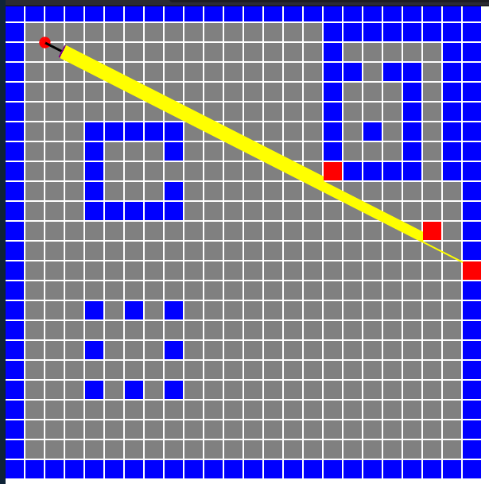
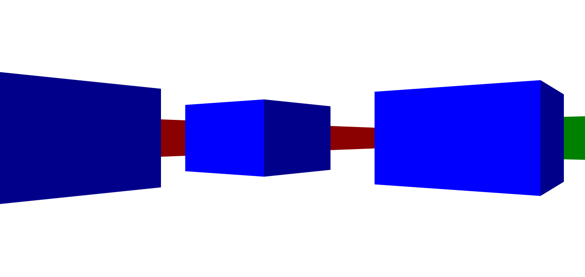

# Protótipo de Raycasting com DDA

Este protótipo foi desenvolvido com base no [Lode's Computer Graphics Tutorial](https://lodev.org/cgtutor/raycasting.html), uma excelente fonte para aprender sobre raycasting, algoritmos gráficos e técnicas relacionadas. O tutorial de Lode foi a minha inspiração e orientação para implementar os conceitos abordados neste projeto.

O objetivo geral é entender como funciona o algoritmo DDA (Digital Differential Analyzer) em um contexto de raycasting. O DDA é uma técnica que foi amplamente utilizada em jogos antigos, como Wolfenstein 3D e Catacomb 3D, para criar efeitos de pseudo-3D em ambientes bidimensionais.

## O que é DDA?

O DDA é um algoritmo de rasterização que calcula pontos ao longo de uma linha entre dois pontos dados. No contexto de raycasting, o DDA é utilizado para traçar raios através de uma grade bidimensional, simulando a projeção de um ambiente 3D.

## Como funciona este protótipo?

Este protótipo utiliza HTML5 Canvas e JavaScript para criar uma simples simulação de um ambiente 3D. O usuário pode movimentar-se pelo ambiente, rotacionar e observar as projeções dos objetos na tela. O DDA é empregado para calcular a interseção de raios lançados a partir da posição do observador.

Por hora, só é possível ou navegar em primeira pessoa, ou em com a visão do mapa, e para isso deve-se trocar o arquivo index.html, chamando o script **main.js** ou **simulaiton.js**.

## Como executar o protótipo?

Basta abrir o arquivo index.html em um navegador web. Use as setas do teclado para movimentar-se e rotacionar. Clique na tela para travar a seta do mouse.

## Referências e Leituras Adicionais

- [Wikipedia - Digital Differential Analyzer](https://en.wikipedia.org/wiki/Digital_differential_analyzer_(graphics_algorithm))
- [Lode's Computer Graphics Tutorial - Raycasting](https://lodev.org/cgtutor/raycasting.html)

Este protótipo é uma ferramenta educacional para entender os conceitos básicos por trás do raycasting e do algoritmo DDA. Sinta-se à vontade para explorar, experimentar e adaptar este código conforme necessário para suas próprias aplicações.