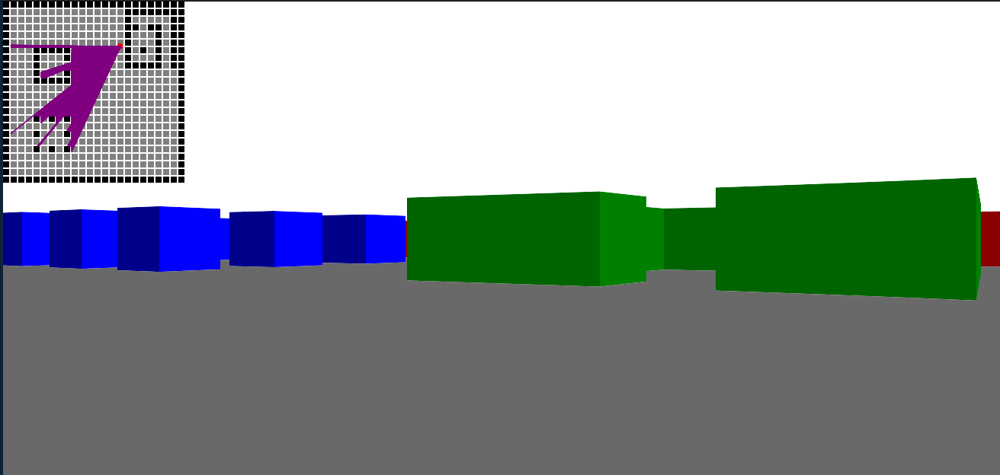

# Raycasting Prototype with DDA

This prototype was developed based on [Lode's Computer Graphics Tutorial](https://lodev.org/cgtutor/raycasting.html), an excellent resource for learning about raycasting, graphics algorithms, and related techniques. Lode's tutorial served as my inspiration and guidance for implementing the concepts covered in this project.

The overall goal is to understand how the Digital Differential Analyzer (DDA) algorithm works in the context of raycasting. DDA is a technique that was widely used in old games like Wolfenstein 3D and Catacomb 3D to create pseudo-3D effects in two-dimensional environments.

## What is DDA?

DDA is a rasterization algorithm that calculates points along a line between two given points. In the context of raycasting, DDA is used to trace rays through a two-dimensional grid, simulating the projection of a 3D environment.

## How does this prototype work?

This prototype uses HTML5 Canvas and JavaScript to create a simple simulation of a 3D environment. Users can move around the environment, rotate, and observe object projections on the screen. DDA is employed to calculate the intersection of rays cast from the observer's position.

## How to run the prototype?

Simply open the index.html file in a web browser. Use the arrow keys to move and the mouse to rotate. Click on the screen to lock the mouse. You can press **z** if your cursor is on the minimap to build/destroy walls.

## References and Additional Readings

- [Wikipedia - Digital Differential Analyzer](https://en.wikipedia.org/wiki/Digital_differential_analyzer_(graphics_algorithm))
- [Lode's Computer Graphics Tutorial - Raycasting](https://lodev.org/cgtutor/raycasting.html)
- [Make 3D Javascript Raycasting Engine - Maksim Ivanov](https://youtu.be/5nSFArCgCXA)
- [Make Your Own Raycaster Part 1 - 3DSage](https://youtu.be/gYRrGTC7GtA)

This prototype is an educational tool to grasp the basic concepts behind raycasting and the DDA algorithm. Feel free to explore, experiment, and adapt this code as needed for your own applications.

# Protótipo de Raycasting com DDA

Este protótipo foi desenvolvido com base no [Lode's Computer Graphics Tutorial](https://lodev.org/cgtutor/raycasting.html), uma excelente fonte para aprender sobre raycasting, algoritmos gráficos e técnicas relacionadas. O tutorial de Lode foi a minha inspiração e orientação para implementar os conceitos abordados neste projeto.

O objetivo geral é entender como funciona o algoritmo DDA (Digital Differential Analyzer) em um contexto de raycasting. O DDA é uma técnica que foi amplamente utilizada em jogos antigos, como Wolfenstein 3D e Catacomb 3D, para criar efeitos de pseudo-3D em ambientes bidimensionais.

## O que é DDA?

O DDA é um algoritmo de rasterização que calcula pontos ao longo de uma linha entre dois pontos dados. No contexto de raycasting, o DDA é utilizado para traçar raios através de uma grade bidimensional, simulando a projeção de um ambiente 3D.

## Como funciona este protótipo?

Este protótipo utiliza HTML5 Canvas e JavaScript para criar uma simples simulação de um ambiente 3D. O usuário pode movimentar-se pelo ambiente, rotacionar e observar as projeções dos objetos na tela. O DDA é empregado para calcular a interseção de raios lançados a partir da posição do observador.

## Como executar o protótipo?

Basta abrir o arquivo index.html em um navegador web. Use as setas do teclado para movimentar-se e use o mouse para rotacionar. Clique na tela para travar a o mouse. Você pode usar a tecla **z** caso seu cursos esteja sobre o minimapa para criar/destruir paredes.

## Referências e Leituras Adicionais

- [Wikipedia - Digital Differential Analyzer](https://en.wikipedia.org/wiki/Digital_differential_analyzer_(graphics_algorithm))
- [Lode's Computer Graphics Tutorial - Raycasting](https://lodev.org/cgtutor/raycasting.html)
- [Make 3D Javascript Raycasting Engine - Maksim Ivanov](https://youtu.be/5nSFArCgCXA)
- [Make Your Own Raycaster Part 1 - 3DSage](https://youtu.be/gYRrGTC7GtA)

Este protótipo é uma ferramenta educacional para entender os conceitos básicos por trás do raycasting e do algoritmo DDA. Sinta-se à vontade para explorar, experimentar e adaptar este código conforme necessário para suas próprias aplicações.